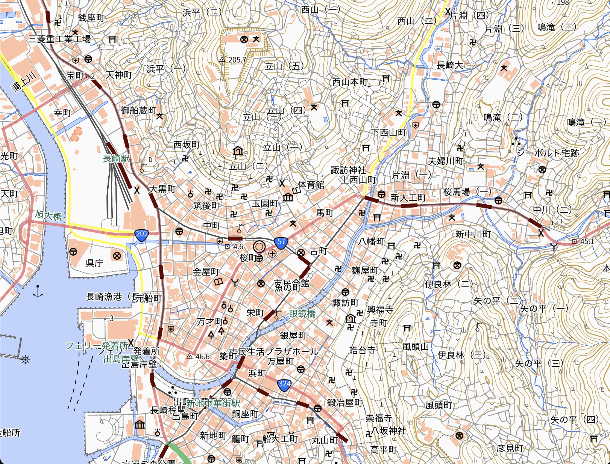
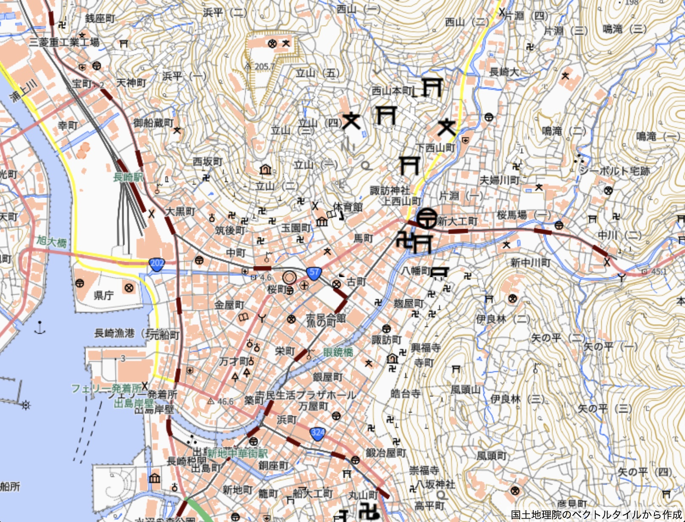

# plow
on-demand real-time server-side image tile rendering using Playwright

PlayWright を使ってベクトルタイルを画像タイルにレンダリングすることのコンセプト実証

## 画像タイルレンダリング前

## 画像タイルレンダリング後

## ファイル説明

### [index.js](index.js)
PlayWright を使って画像タイルを切り出す Node.js プログラム。現在はバッチモードでタイルを保存していくような構成にしているが、オンデマンドリアルタイム画像タイルレンダリングをする場合には、タイルリクエストを受けてから同様にスクリーンショットをとってレスポンスにすることになる。

### [package.json](package.json)
Node.js のパッケージファイル。playwright だけしか使っていないことがわかる。ただし、style.json を作るのに parse-hocon や gl-style-validate を使っている。

### [Rakefile](Rakefile)
タイル生産、スタイル生産、ホストのそれぞれをするためのコマンドを格納している。

### [docs](docs)
ウェブコンテンツ

### [hocon](hocon)
画像タイルを表示するテストサイトに使用する style.json （img.json）のソースファイル。

